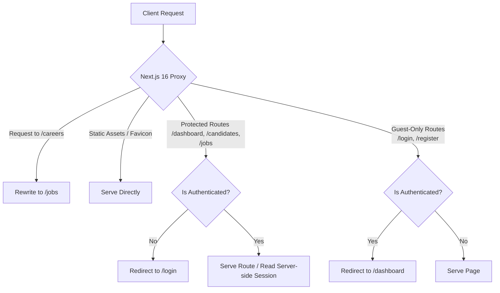

# ⚡ HireSync - Full-Stack Recruitment CRM (Next.js 16 & Auth.js v5)

HireSync is a high-performance, modern Full-Stack Recruitment CRM and HRMS Dashboard built using the cutting-edge **Next.js 16**, **React 19**, **Tailwind CSS**, and **MongoDB**. 

This system acts as a premium enterprise HR platform, incorporating highly robust authentication, custom middleware proxies, secure route-level redirects, request rewrites, and strict validation pipelines.

---

## 🗺️ Architectural Traffic & Authentication Flow

The following Mermaid diagram maps how request security, rewriting, and route protections are executed:



---

## ✨ Features & Architecture Highlights

### 🔒 1. Auth.js (NextAuth v5) & Custom Session Management
Secure, decoupled JWT-based authentication system supporting multiple provider structures:
*   **Database Credentials Provider**: Validates users natively against MongoDB collections. Includes a plaintext password comparison pipeline aligned with our secure API register controller.
*   **Hardcoded Demo Gateway**: Includes a seamless backend bypass for rapid demonstration (`admin` / `password`).
*   **OAuth Providers Ready**: Pre-wired integration hooks for major social sign-in endpoints (GitHub, Google).
*   **JWT & Session Callbacks**: Custom mapping logic inside NextAuth callbacks that propagates custom claims (like user Roles: `admin`, `recruiter`) from MongoDB directly into the active session.

### 🛡️ 2. Modern Next.js 16 proxy.ts Middleware
Using Next.js 16's modern standard, the deprecated `middleware.ts` is replaced by the robust Node-compatible [proxy.ts](file:///c:/Users/pawan/Server-Components/src/proxy.ts) engine:
*   **Secure Route Groups**: Automatically intercepts and blocks unauthorized access to `/dashboard`, `/candidates`, and `/jobs`.
*   **Request Rewriting**: Intercepts inbound calls to `/careers` and silently rewrites them to public `/jobs` internally without modifying the client-side browser URL.
*   **Smart Matching Exclusions**: Uses optimized regular expression matching configurations to exclude internal files, Favicon, CSS, JS, and image assets from processing cycles.

### 🧪 3. Custom Pre-Login validation & Granular Zod Checks
*   **Pre-Login Verification Endpoint**: An isolated endpoint ([/api/auth/login-validate](file:///c:/Users/pawan/Server-Components/src/app/api/auth/login-validate/route.ts)) intercepts credential submit events before NextAuth starts. It checks the database and provides explicit granular client feedback:
    *   **Wrong Email/Username**: Displays *"Enter proper email"*.
    *   **Wrong Password**: Displays *"Enter proper password"*.
*   **REST Endpoint Validation**: Every serverless route uses **Zod schemas** to enforce type-safety and reject malformed payloads prior to performing database write operations:
    *   `/api/auth/register` (uses `registerSchema`)
    *   `/api/candidates` (uses `serverCandidateSchema`)
    *   `/api/jobs` (uses `jobSchema`)

### ⚡ 4. Dynamic Server Component Welcoming
The main admin page ([page.tsx](file:///c:/Users/pawan/Server-Components/src/app/(admin)/dashboard/page.tsx)) extracts credentials directly on the server side using the lightweight `auth()` helper, greeting the logged-in administrator as *"Welcome back, Admin User!"* with zero client-side layout shift.

---

## 🛠️ Technology Stack
*   **Core**: Next.js 16+ (App Router, Turbopack), React 19, TypeScript
*   **Security & Auth**: Auth.js (NextAuth v5.0.0-beta), Zod (v4)
*   **Styling**: Tailwind CSS (v4), PostCSS
*   **Database**: MongoDB, Mongoose
*   **Interactive Components**: AG-Grid Community (React), Lucide React, Recharts, Framer Motion
*   **State Store**: Zustand (v5)

---

## 📂 Folder Structure

```text
Server-Components/
├── src/
│   ├── app/                 # Next.js App Router
│   │   ├── (admin)/         # Route Group: Secured CRM pages (Dashboard, Candidates)
│   │   │   ├── candidates/  # Candidates list with Streaming & custom Skeletons
│   │   │   └── dashboard/   # Live Server Component extracting session info via auth()
│   │   ├── (public)/        # Route Group: Careers (/jobs), Login, and Registration
│   │   ├── api/             # Next.js Serverless API Route Handlers
│   │   │   ├── auth/        # Auth registration & customized pre-validation endpoints
│   │   │   └── candidates/  # Strict REST endpoints validating payloads with Zod
│   │   └── globals.css      # Core Tailwind styling variables
│   │
│   ├── components/          # Reusable component libraries
│   │
│   ├── auth.ts              # NextAuth v5 Instance with Mongoose Providers
│   ├── auth.config.ts       # Decoupled base Auth configurations (safe for all runtimes)
│   ├── proxy.ts             # Next.js 16 Proxy secures routes & request rewrites
│   └── lib/                 # Core MongoDB models & utility helpers
│
├── next.config.ts           # Next.js engine configuration (PPR enabled)
├── tailwind.config.js       # Tailwind configuration
└── package.json             # NPM package scripts & dependency declarations
```

---

## 🚀 Getting Started

### 1. Prerequisites
*   Node.js (v18.x or higher)
*   MongoDB running locally or a MongoDB Atlas connection URI string.

### 2. Environment Configuration
Create a `.env.local` file in the root of the project:
```env
MONGODB_URI=mongodb://127.0.0.1:27017/recruitment
AUTH_SECRET=hiresync-very-secret-development-key-32-chars-long-1234
```

### 3. Installation
Install all required NPM packages:
```bash
npm install
```

### 4. Running the Development Server
Launch the development build on port `3000` under Turbopack:
```bash
npm run dev
```
Open [http://localhost:3000](http://localhost:3000) in your browser.

### 5. Quick Demo Credentials
Use these quick logins on the sign-in screen:
*   **Admin Account**: Username: `admin` \| Password: `password`
*   **Database Recruiter Account**: Username: `recruiter@hiresync.com` \| Password: `password123`
